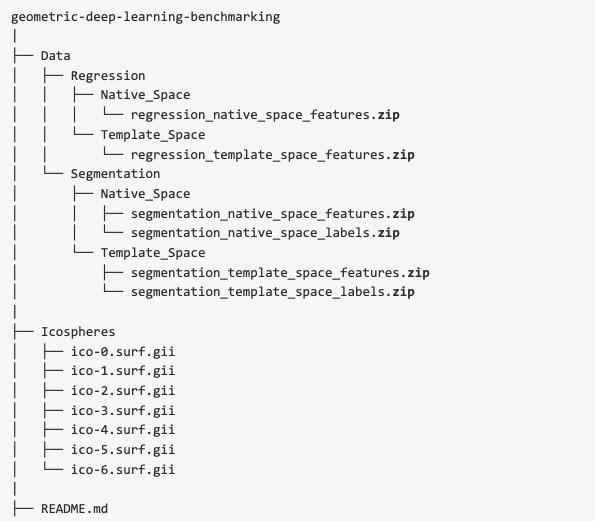
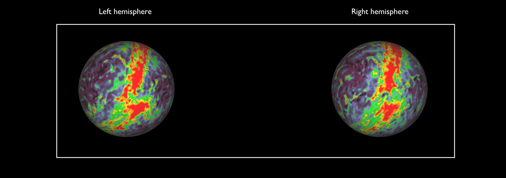

# Surface Vision Transformers

This repository contains codebase to apply vision transformers on surface data. This is the official PyTorch implementation of [Surface Vision Transformers: Attention-Based Modelling applied to Cortical Analysis](https://arxiv.org/abs/2203.16414), presented at the MIDL 2022 conference.  


Here, Surface Vision Transformer (**SiT**) is applied on cortical data for phenotype predictions.


# Updates

<details>
    <summary><b> V.1.0 - 18.07.22</b></summary>
    Major codebase update - 18.07.22
    <ul type="circle">
        <li> birth age and scan age prediction tasks</li>
        <li> simplifying training script </li>
        <li> adding birth age prediction script </li>
        <li> simplifying preprocessing script </li>
        <li> ingle config file tasks (scan age / birth age) and data configurations (template / native)</li>
        <li> adding mesh indices to extract non-overlapping triangular patches from a cortical mesh ico 6 sphere representation</li>
    </ul>
</details>

<details>
    <summary><b> V.0.2</b></summary>
    Update - 25.05.22
    <ul type="circle">
        <li> testing file and config </li>
        <li> installation guidelines </li>
        <li> data access </li>
    </ul>
</details>

<details>
    <summary><b> V.0.1</b></summary>
    Initial commits - 12.10.21
    <ul type="circle">
        <li> training script </li>
        <li> README </li>
        <li> config file for training </li>
    </ul>
</details>

# Installation

## Connectome Workbench

Connectome Workbench is a free software for visualising neuroimaging data and can be used for visualising cortical metrics on surfaces. Downloads and instructions [here](https://www.humanconnectome.org/software/connectome-workbench). 

## Conda usage

For PyTorch and dependencies installation with conda, please follow instructions in [install.md](docs/install.md).

## Docker usage

**Coming soon**

For docker support, please follow instructions in [docker.md](docs/docker.md)

# Data 

Data used in this project comes from the [dHCP dataset](http://www.developingconnectome.org/). Instructions for processing MRI scans and extract cortical metrics can be found in [S. Dahan et al 2021](https://arxiv.org/abs/2203.16414) and references cited in.

To simplify reproducibility of the work, data has been already processed and is made available by following the next guidelines. 


## Accessing processed data

Cortical surface metrics already processed as in [S. Dahan et al 2021](https://arxiv.org/abs/2203.16414) and [A. Fawaz et al 2021](https://www.biorxiv.org/content/10.1101/2021.12.01.470730v1) are available upon request. 

<details>
    <summary><b> How to access the processed data?</b></summary>
    <p>
    To access the data please:
    <br>
        <ul type="circle">
            <li>Sign in <a href="/https://data.developingconnectome.org/app/template/Login.vm">here</a> </li>
            <li>Sign the dHCP open access agreement </li>
            <li> Forward the confirmation email to <b> slcn.challenge@gmail.com</b>  </li>
        </ul>
    </br>
    </p>
</details>
<details>
  <summary><b> G-Node GIN repository</b></summary>
      <p>
      Once the confirmation has been sent, you will have access to the <b>G-Node GIN repository</b> containing the data already processed.
      The data used for this project is in the zip files <i>`regression_native_space_features.zip`</i> and <i>`regression_template_space_features.zip`</i>. You also need to use the <i>`ico-6.surf.gii`</i> spherical mesh. 
       
      </p>
</details>

**Training** and **validation** sets are available for the task of **birth-age** and **scan-age** prediction, in **template** and **native** configuration.

However the test set is not currently publicly available as used as testing set in the [SLCN challenge](https://slcn.grand-challenge.org/) on surface learning alongside the MLCN workshop at MICCAI 2022. 

## Data preparation for training

Once the data is accessible, further preparation steps are required to get right and left metrics files in the same orientation, before extracting the sequences of patches.

1. Download zip files containing the cortical features: `regression_template_space_features.zip` and `regression_native_space_features.zip`. Data is in the format
```
{uid}_{hemi}.shape.gii 
```

2. Download the `ico-6.surf.gii` spherical mesh from the G-Node GIN repository. This icosphere is *by default* set to a CORTEX_RIGHT structure in workbench. 

3. Rename the `ico-6.surf.gii` file as `ico-6.R.surf.gii`

4. Create a new sphere by symmetrising the righ sphere using workbench. In bash:

```
wb_command -surface-flip-lr ico-6.R.surf.gii ico-6.L.surf.gii
```
5. Then, set the structure of the new icosphere to `CORTEX_LEFT`. In bash:
```
wb_command -set-structure ico-6.L.surf.gii CORTEX_LEFT
```

6. Use the new left sphere to resample all left metric files. In bash: 
```
for i in *L*; do wb_command -metric-resample ${i} ../ico-6.R.surf.gii ../ico-6.L.surf.gii BARYCENTRIC ${i}; done
```

<details>
  <summary><b> Example of left and right myelin maps</b></summary>
      <p>
      Once symmetrised, both left and right hemispheres have the same orientation when visualised on a left hemipshere template. 
       
      </p>
</details>


7. Once this step is done, the preprocessing script can be used to prepare the training and validation numpy array files, per task (birth-age, scan-age) and data configuration (template, native). Set the parameters in the YAML file `config/preprocessing/hparams.yml` and run the `preprocessing.py` script in ./tools:

```
python preprocessing.py ../config/preprocessing/hparams.yml
```

# Commands

## Training SiT

For training a SiT model, use the following command:

```
python train.py ../config/SiT/training/hparams.yml
```
Where all hyperparameters for training and model design models are to be set in the yaml file *hparams.yml*, such as: 

- Training strategy: from scratch, ImageNet or SSL weights
- Optimisation
- Patching configuration
- Logging

## Testing SiT

For testing a SiT model, please put the path of the SiT weights in /testing/hparams.yml and use the following command: 

```
python test.py ../config/SiT/training/hparams.yml
```

# Tensorboard support

**Coming soon**

# References 

This codebase uses the vision transformer implementation from  
[lucidrains/vit-pytorch](https://github.com/lucidrains/vit-pytorch) and the pre-trained ViT models from the [*timm*](https://github.com/rwightman/pytorch-image-models) librairy. 

# Citation

Please cite these works if you found it useful:

[Surface Vision Transformers: Attention-Based Modelling applied to Cortical Analysis](https://arxiv.org/abs/2203.16414)

```
@article{dahan2022surface,
  title={Surface Vision Transformers: Attention-Based Modelling applied to Cortical Analysis},
  author={Dahan, Simon and Fawaz, Abdulah and Williams, Logan ZJ and Yang, Chunhui and Coalson, Timothy S and Glasser, Matthew F and Edwards, A David and Rueckert, Daniel and Robinson, Emma C},
  journal={arXiv preprint arXiv:2203.16414},
  year={2022}
}
```
[Surface Vision Transformers: Flexible Attention-Based Modelling of Biomedical Surfaces](https://arxiv.org/abs/2204.03408)

```
@article{dahan2022surface,
  title={Surface Vision Transformers: Flexible Attention-Based Modelling of Biomedical Surfaces},
  author={Dahan, Simon and Xu, Hao and Williams, Logan ZJ and Fawaz, Abdulah and Yang, Chunhui and Coalson, Timothy S and Williams, Michelle C and Newby, David E and Edwards, A David and Glasser, Matthew F and others},
  journal={arXiv preprint arXiv:2204.03408},
  year={2022}
}
```


