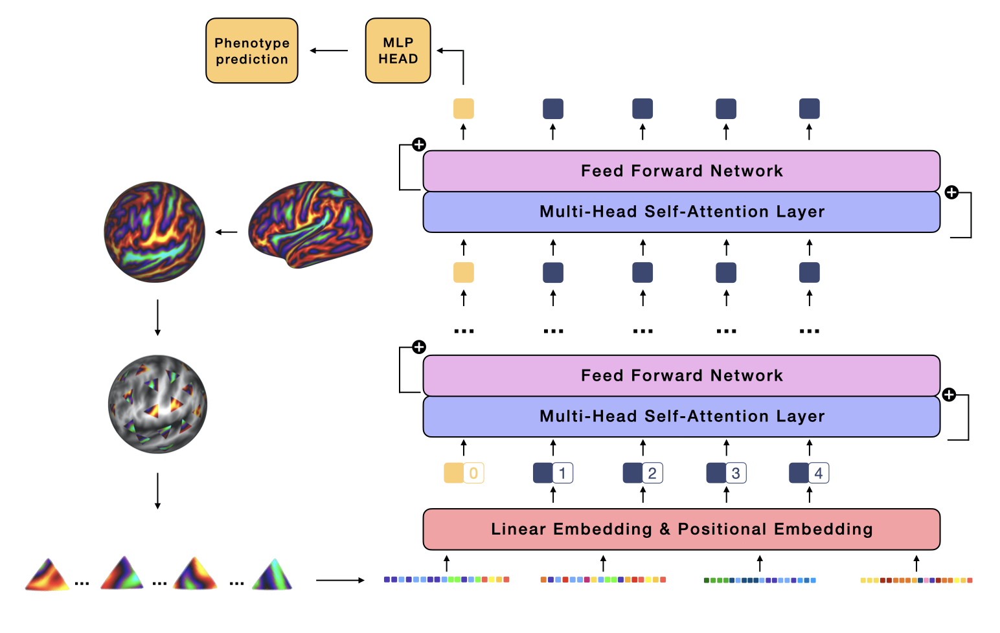

# Surface Vision Transformers

This repository contains codebase to apply vision transformers on surface data. This is the official PyTorch implementation of [Surface Vision Transformers: Attention-Based Modelling applied to Cortical Analysis](https://arxiv.org/abs/2203.16414), presented at the MIDL 2022 conference.  


Here, Surface Vision Transformer (**SiT**) is applied on cortical data for phenotype predictions.




# Installation

## Conda usage

For PyTorch and dependencies installation with conda, please follow instructions in [install.md](docs/install.md).

## Docker usage

**Coming soon**

For docker support, please follow instructions in [docker.md](docs/docker.md)

# Data 

Data used for the task of scan age prediction comes from the [dHCP dataset](http://www.developingconnectome.org/). 

## Accessing the data

Neonatal data can be downloaded from the dHCP website.

Instructions for processing MRI scans to extract cortical metrics can be found in [Surface Vision Transformers: Attention-Based Modelling applied to Cortical Analysis](https://arxiv.org/abs/2203.16414) and references cited in. 

Otherwise, cortical surface metric already processed (as used in the SiT paper) are also available. 

To access the data please: 
- Sign in [here](https://data.developingconnectome.org/app/template/Login.vm)
- Sign the dHCP open access agreement
- Forward the confirmation email to **slcn.challenge@gmail.com**

## Connectome Workbench

Connectome Workbench is a free software for visualising neuroimaging data and can be used for visualising cortical metrics on surfaces. Downloads and instructions [here](https://www.humanconnectome.org/software/connectome-workbench). 

## Extracting Patches from surface data. 

1. Create a template 6th-order icosphere (40962) using:

```
wb_command -surface-create-sphere 40962 <sphere-out>
```

2. Resample your cortical data using from your surface template this surface ico-6 template.

```
wb_command -metric-resample <metric-in> <current-sphere> <new-sphere> BARYCENTRIC <metric-out>
```

3. Extract patches using the vertices indices provided in [triangle_indices.csv](tools/triangle_indices.md).

# Commands

## Training SiT

For training a SiT model, use the following command:

```
python train.py ../config/SiT/training/hparams.yml
```
Where all hyperparameters for training and model design models are to be set in the yaml file *hparams.yml*, such as: 

- Training strategy: from scratch, ImageNet or SSL weights
- Optimisation
- Patching configuration
- Logging

## Testing SiT

For testing a SiT model, please put the path of the SiT weights in /testing/hparams.yml and use the following command: 

```
python test.py ../config/SiT/training/hparams.yml
```

# Tensorboard support

**Coming soon**

# References 

This codebase uses the vision transformer implementation from  
[lucidrains/vit-pytorch](https://github.com/lucidrains/vit-pytorch) and the pre-trained ViT models from the [*timm*](https://github.com/rwightman/pytorch-image-models) librairy. 

# Citation

Please cite these works if you found it useful:

[Surface Vision Transformers: Attention-Based Modelling applied to Cortical Analysis](https://arxiv.org/abs/2203.16414)

```
@article{dahan2022surface,
  title={Surface Vision Transformers: Attention-Based Modelling applied to Cortical Analysis},
  author={Dahan, Simon and Fawaz, Abdulah and Williams, Logan ZJ and Yang, Chunhui and Coalson, Timothy S and Glasser, Matthew F and Edwards, A David and Rueckert, Daniel and Robinson, Emma C},
  journal={arXiv preprint arXiv:2203.16414},
  year={2022}
}
```
[Surface Vision Transformers: Flexible Attention-Based Modelling of Biomedical Surfaces](https://arxiv.org/abs/2204.03408)

```
@article{dahan2022surface,
  title={Surface Vision Transformers: Flexible Attention-Based Modelling of Biomedical Surfaces},
  author={Dahan, Simon and Xu, Hao and Williams, Logan ZJ and Fawaz, Abdulah and Yang, Chunhui and Coalson, Timothy S and Williams, Michelle C and Newby, David E and Edwards, A David and Glasser, Matthew F and others},
  journal={arXiv preprint arXiv:2204.03408},
  year={2022}
}
```


